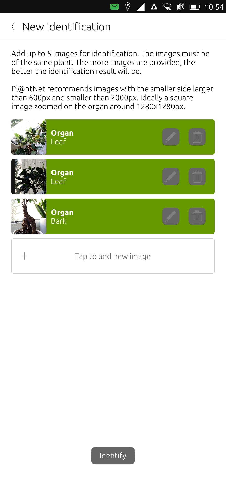
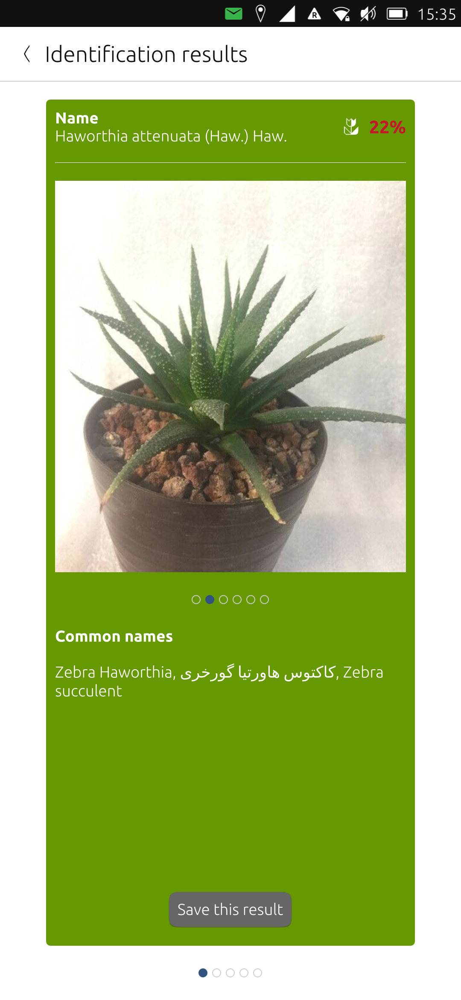

# Plants
Identify plants by analyzing images

## Features

This app enables the user to identify the species of a plant by submitting photos for identification. The identification result will contain the name of the species, common names (if known), and a score (percentage) of how accurate the identification was.
Identification results can be saved in the app along with the photos which were used to identify the plant.

For identification, the my.plantnet.org service for plant identification is used. This means, a working internet connection is necessary to use the app.

Please note that this is NOT an official Pl@ntNet app.

# License

Copyright (C) 2022-2022 Patrick Fial

Licensed under the MIT license

# Copyright notice
- <a href="https://www.flaticon.com/free-icons/plant" title="plant icons">Plant icons created by Freepik - Flaticon</a>
- This app uses the my.plantnet.org API to identify plants (https://my.plantnet.org/usage)

